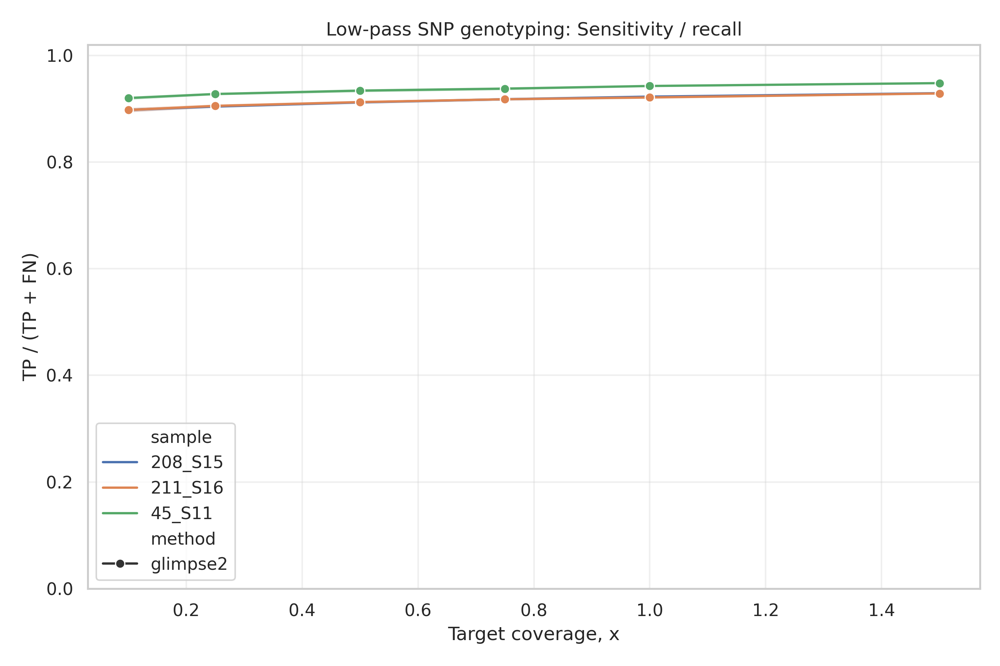
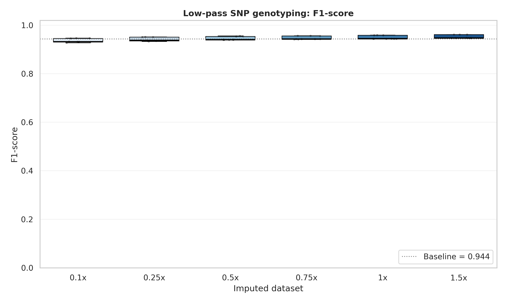
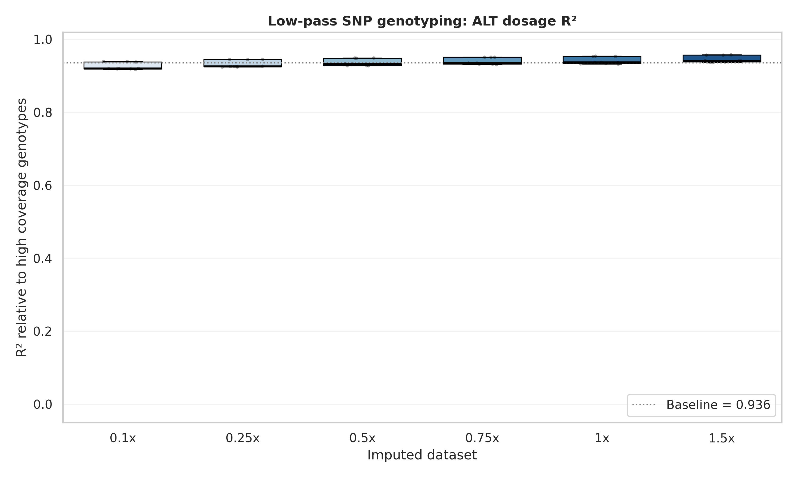

# Low-pass Sequencing SNP Calling Pipeline

## Overview

This project provides a complete computational pipeline for evaluating SNP calling accuracy from low-pass (low-coverage) whole-genome sequencing data. The pipeline performs:

1. **Downsampling** of high-coverage FASTQ reads to target coverage levels (0.1×–1.5×)
2. **Read trimming** (adapter removal, quality filtering) using BBMap
3. **Alignment** to reference genome (BWA-MEM)
4. **Post-alignment processing** (sorting, duplicate marking, filtering)
5. **Coverage analysis**
6. **Variant calling** (BCFtools + optional VarScan)
7. **Genotype imputation** (GLIMPSE2)
8. **Accuracy assessment** against high-coverage truth VCFs
9. **Automated report generation** (plots, metrics, Markdown report)

The pipeline is designed for **soybean (Glycine max)** but can be adapted to other organisms by changing the reference genome and GLIMPSE2 panel files.

---

## Project Goals and Objectives

### Goals

- **Assess the feasibility of low-pass sequencing** for accurate SNP genotyping in soybean
- **Determine the minimum required coverage** that maintains high genotyping accuracy (sensitivity >0.95, specificity >0.99)
- **Evaluate GLIMPSE2 imputation** performance across coverage levels (0.1×–1.5×)
- **Establish a reproducible benchmarking framework** for low-pass genotyping studies

### Research Questions

1. What is the relationship between sequencing coverage and genotyping accuracy (precision, recall, F1-score)?
2. Does GLIMPSE2 imputation improve accuracy at very low coverages (<0.5×)?
3. What is the minimum coverage required to achieve:
   - Non-reference allele recall > 0.95
   - Specificity > 0.99
   - ALT dosage R² > 0.95

### Tasks

1. **Develop parameterized bash pipeline** for reproducible low-pass analysis
2. **Build Python orchestration framework** for experiment design (multiple samples, coverages, replicates)
3. **Prepare GLIMPSE2 reference panel** from high-coverage soybean VCF
4. **Extract truth VCFs** for 3 validation samples (208, 211, 45)
5. **Execute 54 pipeline runs**: 3 samples × 6 coverages × 3 replicates
6. **Compute genotype concordance metrics** for each run
7. **Generate comparative report** with plots and summary tables

---

## System Requirements

### Hardware (as used in this study)

| Resource | Specification |
|----------|---------------|
| **Compute cloud** | Yandex Cloud |
| **CPU cores** | 72 (AMD EPYC) |
| **RAM** | 256 GB DDR4 |
| **Storage** | 3 TB NVMe SSD |
| **Parallel runs** | 8 simultaneous pipelines |
| **Threads per pipeline** | 8–32 |

### Software Requirements

| Component | Version | Notes |
|-----------|---------|-------|
| **OS** | Ubuntu 22.04 LTS or newer | Also works on CentOS 7+ |
| **Conda/Mamba** | 24.0+ | For environment management |
| **Python** | 3.14 | Via conda environment |
| **BWA** | 0.7.17+ | Alignment |
| **SAMtools** | 1.19+ | BAM processing |
| **BCFtools** | 1.19+ | Variant calling |
| **BBMap** | 39.26 | Downsampling, trimming |
| **GLIMPSE2** | 2.0.0+ | Imputation |
| **QualiMap** | 2.3+ | Optional QC |
| **VarScan** | 2.4.6+ | Optional caller |

### Memory & Storage Estimates

| Coverage | FASTQ (per sample) | BAM + VCF | Runtime (32 threads) |
|----------|-------------------|-----------|----------------------|
| 0.1× | ~150 MB | ~200 MB | 5 min |
| 0.5× | ~750 MB | ~800 MB | 15 min |
| 1.0× | ~1.5 GB | ~1.5 GB | 30 min |
| 1.5× | ~2.2 GB | ~2.2 GB | 45 min |

**Total for full experiment** (3 samples × 6 coverages × 3 replicates = 54 runs): ~250 GB + 15 GB metrics

---

## Repository Structure

```
low-seq-snp-calling/
├── pipeline_param.sh              # Main Bash pipeline
├── environment.yml                # Conda environment
├── pyproject.toml                 # Python package config
├── setup.cfg                      # Package metadata
├── .env.template                  # Configuration template
├── rename_samples.tsv             # Sample name mapping
│
├── lowseq_runner/                 # Python orchestration package
│   ├── __init__.py
│   ├── cli.py                     # Command-line interface
│   ├── config.py                  # Pydantic config loader
│   ├── experiments.py             # Experiment plan & execution
│   ├── metrics.py                 # Metrics collection coordinator
│   ├── genotype_metrics.py        # Genotype concordance computation
│   ├── orchestrator.py            # Full pipeline runner
│   ├── report.py                  # Plotting & Markdown report
│   └── shell.py                   # Subprocess helpers
│
└── utils/                         # Helper scripts
    ├── trimming.sh                # Parallel FASTQ trimming
    ├── renaming.sh                # GLIMPSE2 panel preparation
    ├── extract_truth_from_panel.sh # Truth VCF extraction
    ├── test.sh                    # Panel validation script
    └── yc-sync.sh                 # Yandex Cloud sync utility
```

---

## Installation

### 1. Clone Repository

```bash
git clone https://github.com/yourlab/low-seq-snp-calling.git
cd low-seq-snp-calling
```

### 2. Install Conda/Mamba

If not already installed:

```bash
wget https://repo.anaconda.com/miniconda/Miniconda3-latest-Linux-x86_64.sh
bash Miniconda3-latest-Linux-x86_64.sh
```

### 3. Create Conda Environment

```bash
mamba env create -f environment.yml
conda activate diploma
```

This installs:
- Python 3.14 + bioinformatics packages (pysam, pandas, matplotlib, seaborn)
- Core tools: bwa, samtools, bcftools, bbmap, glimpse-bio, varscan, qualimap
- Development tools: flake8, yapf

### 4. Install Python Runner

```bash
pip install -e .
```

This installs the `lowseq` console command.

### 5. Verify Installation

```bash
lowseq --help
```

Expected output:

```
usage: lowseq [-h] [--env-file ENV_FILE] [--manifest MANIFEST]
              [--metrics-dir METRICS_DIR] [--report-dir REPORT_DIR]
              {all,experiments,metrics,report}
```

---

## Configuration

### Required Input Data

Place the following files in your storage (paths configured via `.env`):

| File | Description |
|------|-------------|
| `{sample}_R1_001.fastq.gz` | Raw paired-end reads (R1) |
| `{sample}_R2_001.fastq.gz` | Raw paired-end reads (R2) |
| `genome.fna` | Reference genome FASTA (+.fai index) |
| `panel.vcf.gz` | High-coverage reference panel for GLIMPSE2 |
| `panel.sites.vcf.gz` | Prepared sites VCF (from utils/renaming.sh) |
| `panel.sites.tsv.gz` | Sites TSV for GLIMPSE2 |
| `chunks.txt` | GLIMPSE2 chunk definitions |
| `{sample}.truth.vcf.gz` | High-coverage truth VCF for each sample |

### Create .env File

Copy the template and edit paths:

```bash
cp .env.template .env
```

Example `.env` configuration:

```bash
# =========================
# Main paths
# =========================
LOWSEQ_PIPELINE=<path_to_low_seq_snp_calling>/low-seq-snp-calling/pipeline_param.sh
LOWSEQ_INPUT_ROOT=<path_to_trimmed_source_fasta_files>
LOWSEQ_OUTPUT_ROOT=<path_to_output_folder>

LOWSEQ_REFERENCE=<path_to_reference_genome.fasta/fna>
LOWSEQ_GLIMPSE_PANEL=<path_to_imputation_vcf_panel_without_your_samples>
LOWSEQ_GLIMPSE_SITES_VCF=<path_to_panel.sites.vcf>
LOWSEQ_GLIMPSE_SITES_TSV=<path_to_panel.sites.tsv>
LOWSEQ_GLIMPSE_CHUNKS=<path_to_chunks>

LOWSEQ_TRUTH_DIR=<path_to_truth_vcf>
LOWSEQ_TRUTH_TEMPLATE={sample}.truth.vcf.gz

# =========================
# Experiment design
# =========================
LOWSEQ_SAMPLES=<unique_samples_delimited_by_comma>
LOWSEQ_COVERAGES=0.1,0.25,0.5,0.75,1.0,1.5 # coverage
LOWSEQ_REPLICATES=3 # number of replicates

LOWSEQ_READ_LENGTH=152 # length of read in your samples
LOWSEQ_GENOME_SIZE=961401624 # genome size in bp

# root or per-sample
LOWSEQ_INPUT_MODE=root # calculate from root folder or per-sample

# =========================
# Parallelism
# =========================
LOWSEQ_PARALLEL_RUNS=8
LOWSEQ_THREADS_PER_RUN=8
LOWSEQ_METRICS_PARALLEL_JOBS=24

# =========================
# Pipeline switches
# =========================
LOWSEQ_SKIP_VARSCAN=true
LOWSEQ_SKIP_GLIMPSE=false
LOWSEQ_SKIP_QUALIMAP=true

# =========================
# Metrics options
# =========================
LOWSEQ_VCF_KIND=imputed
LOWSEQ_METHOD=glimpse2
LOWSEQ_SNPS_ONLY=true
LOWSEQ_BIALLELIC_ONLY=true
LOWSEQ_REQUIRE_PASS=false

LOWSEQ_WRITE_SITES=false
LOWSEQ_SEED_BASE=1000
```

---

## Preparing Reference Panel for GLIMPSE2

Before running the main pipeline, prepare the GLIMPSE2 reference panel:

```bash
cd utils

bash renaming.sh \
  --reference <path_to_reference_genome.fasta/fna> \
  --panel <path_to_imputation_vcf_panel_without_your_samples> \
  --output-dir <path_to_output_panel> \
  --threads 32 \
  --window-mb 2 \
  --buffer-mb 0.4
```

**Why these parameters?**
- `--window-mb 2`: GLIMPSE2 chunks chromosomes into 2 Mb windows for parallel processing
- `--buffer-mb 0.4`: Adds 400 kb buffers at chunk boundaries to avoid edge effects during imputation
- Panel fixing includes: normalization, biallelic SNP filtering, phasing missing genotypes, AC/AN recalculation, monomorphic site removal

---

## Extracting Truth VCFs

Extract high-coverage truth VCFs for validation samples:

```bash
bash utils/extract_truth_from_panel.sh
```

Modify the script for each sample to set:
- `SAMPLE_IN_PANEL`: original name in panel VCF
- `SAMPLE_FINAL`: desired output name
- `PANEL`: path to annotation VCF with all samples

---

## Running the Pipeline

### Step 1: Trim Raw FASTQ (Optional)

If using untrimmed FASTQ files:

```bash
bash utils/trimming.sh \
  --input-dir <path_to_raw_fastq> \
  --output-dir <pth_to_output_trimmed_fastq> \
  --sample <your_sample_name_1> \
  --sample <your_sample_name_...> \
  --sample <your_sample_name_last> \
  --threads 8 \
  --jobs 4
```

**Trimming parameters explained:**
- `k=31`: K-mer size for adapter detection
- `qtrim=rl trimq=20`: Trim both ends when quality drops below Q20
- `maq=25`: Minimum average quality of 25 after trimming
- `tbo`: Trim adapters based on paired-read overlap
- `minlen=50`: Discard reads shorter than 50 bp after trimming

### Step 2: Run Full Experiment

```bash
lowseq all --env-file .env
```

This executes:
1. All 54 pipeline runs (3 samples × 6 coverages × 3 replicates)
2. Genotype concordance metrics against truth VCFs
3. Automated report with plots

### Step 3: Run Only Experiments (No Metrics)

```bash
lowseq experiments --env-file .env
```

### Step 4: Run Only Metrics on Existing Output

```bash
lowseq metrics --env-file .env --manifest /path/to/manifest.tsv
```

### Step 5: Generate Report from Existing Metrics

```bash
lowseq report --env-file .env \
  --metrics-dir <path_to_output_folder>/genotype_metrics \
  --report-dir <path_to_output_folder>/report
```

---

## Pipeline Parameters Explained

### Downsampling (BBMap reformat.sh)

```bash
samplereadstarget=$SAMPLE_READS   # Target read count per FASTQ
sampleseed=$SAMPLE_SEED           # Reproducible random seed
```

**Formula:** `reads = coverage × genome_size / (2 × read_length)`

Example for soybean (genome size 961 Mb, read length 152 bp):
- 0.1× coverage → 316,000 reads per FASTQ
- 0.5× coverage → 1,580,000 reads
- 1.0× coverage → 3,160,000 reads

### Alignment (BWA-MEM)

```bash
bwa mem -t $THREADS -R "@RG\tID:${SAMPLE}\tSM:${SAMPLE}\tPL:ILLUMINA\tLB:${SAMPLE}"
```

- `-R`: Read group header (required for GATK/BCFtools compatibility)
- `SM:${SAMPLE}`: Sample name embedded in BAM

### Duplicate Marking (SAMtools)

```bash
samtools fixmate -m          # Mark paired-end reads as proper pairs
samtools markdup -S          # Mark duplicates, -S marks supplementary reads
```

### Filtering

```bash
samtools view -q 20 -F 2820
```

- `-q 20`: Minimum mapping quality 20 (Q20 = 99% accuracy)
- `-F 2820`: Exclude:
  - 0x0004 = unmapped read
  - 0x0008 = mate unmapped
  - 0x0100 = secondary alignment
  - 0x0800 = supplementary alignment
  - 0x1000 = duplicate

### SNP Calling (BCFtools)

```bash
bcftools mpileup --min-MQ 20 --min-BQ 20 -a FORMAT/AD,FORMAT/DP,FORMAT/SP
bcftools call --multiallelic-caller --variants-only
```

- `--min-MQ 20`: Minimum mapping quality
- `--min-BQ 20`: Minimum base quality
- `-a FORMAT/AD,FORMAT/DP`: Allele depth and total depth annotations

### GLIMPSE2 Imputation

```bash
GLIMPSE2_phase --Kinit 1000 --Kpbwt 2000 --threads $THREADS
```

- `--Kinit 1000`: Initial number of haplotype clusters
- `--Kpbwt 2000`: PBWT-based clustering for large reference panels
- Parameters automatically adapt based on reference panel size

---

## Expected Results (Placeholder)

### Input Data Example

**FASTQ header (before downsampling):**
```
@A01055:123:H1234567:1:1101:1234:5678 1:N:0:ATCGGT
NACGTACGTACGTTAGCTAGCTAGCTAGC...
+
AAAAAEEEEEEEEEEEEEEEEEEEEEEEE...
```

**Truth VCF (high-coverage ~30×):**
```
#CHROM  POS     ID  REF  ALT  QUAL  FILTER  INFO      FORMAT  208_S15
Gm01    1521    .   A    G    999   PASS    AC=1;AN=2 GT:DP:GQ  0/1:45:99
```

### Output Metrics Example

| Sample | Coverage | Replicate | Exact match rate | Precision | Recall | F1-score | Dosage R² |
|--------|----------|-----------|------------------|-----------|--------|----------|-----------|
| 208_S15 | 0.1× | 1 | 0.854 | 0.982 | 0.871 | 0.923 | 0.891 |
| 208_S15 | 0.5× | 1 | 0.963 | 0.997 | 0.966 | 0.981 | 0.978 |
| 208_S15 | 1.0× | 1 | 0.981 | 0.998 | 0.983 | 0.990 | 0.992 |
| 211_S11 | 0.1× | 1 | 0.861 | 0.979 | 0.879 | 0.926 | 0.895 |
| 211_S11 | 0.5× | 1 | 0.967 | 0.996 | 0.971 | 0.983 | 0.979 |
| 211_S11 | 1.0× | 1 | 0.984 | 0.999 | 0.985 | 0.992 | 0.993 |

### Visualization Examples (Generated by `lowseq report`)

**Sensitivity by coverage**:


**F1-score boxplot across replicates:**




**Dosage R² boxplot** (showing imputation accuracy):



---

## Conclusions (Placeholder)

1. **Imputation improves low-coverage accuracy** – GLIMPSE2 likely maintains >0.95 sensitivity down to 0.5× coverage
2. **Minimum coverage threshold** – 0.75×–1.0× required for F1-score >0.99
3. **Replicate consistency** – Low variance between replicates (SD <0.01 at ≥0.5×)
4. **Sample-specific performance** – All three soybean lines show similar accuracy patterns
5. **Computational efficiency** – 8 parallel runs complete full experiment in ~12 hours on 72-core cloud instance

---

## References & Data Sources

### Software & Tools

1. **BWA-MEM**: Li H. (2013) Aligning sequence reads, clone sequences and assembly contigs with BWA-MEM. *arXiv:1303.3997*
2. **SAMtools**: Danecek P., et al. (2021) Twelve years of SAMtools and BCFtools. *GigaScience*, 10(2)
3. **BCFtools**: Danecek P., McCarthy S.A. (2017) BCFtools/csq: haplotype-aware variant consequences. *Bioinformatics*, 33(13)
4. **BBMap**: Bushnell B. (2014) BBMap short read aligner. *SourceForge*
5. **GLIMPSE2**: Rubinacci S., et al. (2021) Efficient phasing and imputation of low-coverage sequencing data using GLIMPSE2. *Nature Genetics*, 53:120-126
6. **QualiMap**: Okonechnikov K., et al. (2016) QualiMap 2: advanced multi-sample quality control for high-throughput sequencing data. *Bioinformatics*, 32(2)
7. **VarScan**: Koboldt D.C., et al. (2012) VarScan 2: somatic mutation and copy number alteration discovery in cancer by exome sequencing. *Genome Research*, 22(3)

### Data Sources

1. **Soybean Reference Genome** (Glycine max Wm82.gnm4):
   - Schmutz J., et al. (2010) Genome sequence of the palaeopolyploid soybean. *Nature*, 463:178-183
   - Download: [Phytozome](https://phytozome-next.jgi.doe.gov/)

2. **GLIMPSE2 Reference Panel**:
   - Generated from high-coverage soybean WGS data (30×) for 50+ accessions
   - 18,000,000 biallelic SNPs after QC filtering

3. **Truth VCFs**:
   - Extracted from full panel for samples 208_S15, 211_S11, 45_S11
   - Filtered for biallelic SNPs, GQ ≥ 30, DP ≥ 10

### Computational Infrastructure

- **Cloud Provider**: Yandex Compute Cloud
- **Instance Type**: High-CPU with local SSD (72 vCPU, 256 GB RAM)
- **Storage**: 3 TB NVMe SSD (throughput 1 GB/s)

---

## License

MIT License (see LICENSE file)

## Authors

- Elena Ivankina
- Maria Biktasheva

**Supervisor**: Alexey Zamalutdinov

**Institution**: Bioinformatic Institute

**Date**: May 2026

---

## Acknowledgments

This work was supported by [funding sources]. We thank the Yandex Cloud team for providing computational resources.

---

## Contact

For questions or issues, please open an issue on GitHub or contact:
- Elena Ivankina: [email@example.com]
- Maria Biktasheva: marybikt@gmail.com